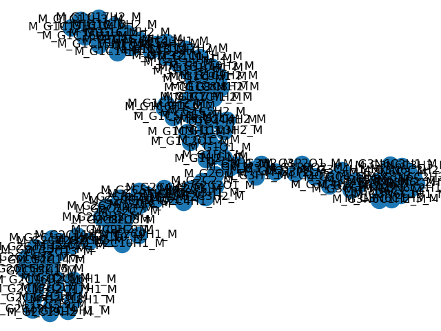
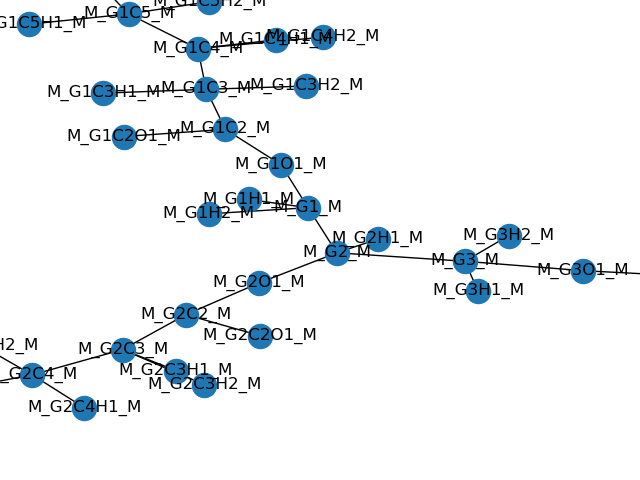
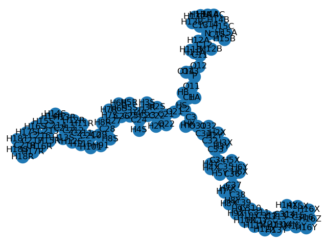
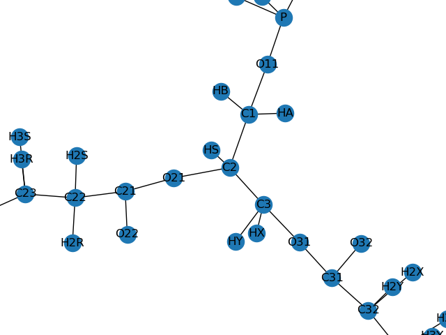

# autoLipMap

autoLipMap is an automatic lipid mapping topology writer from a pdb file containing a single lipid (including all hydrogens). It writes a [mapping file](https://github.com/NMRLipids/MATCH/tree/master/MAPPING) and [def file](https://github.com/NMRLipids/MATCH/tree/master/scripts/orderParm_defs) which are useful for calculating the order parameters from molecular simulations in the [NMRlipids projects](https://nmrlipids.blogspot.com).

A mapping file typically consists of :

```
M_G1_M        C32
M_G1H1_M      H322
M_G1H2_M      H321
M_G1O1_M      O33
[...]
```

The first column contains the **mapping names** for each atom in a lipid. It has been designed to unambiguously refer to each atom in a lipid starting from the 3 carbons in the glycerol (names `M_G1_M`, `M_G2_M` and `M_G3_M`). The second column contains atom names which are found in a pdb structure - called **pdb names** in this document - and are thus force field dependent.

The def file looks like this :

```
beta1 POPC CD H1D
beta2 POPC CD H2D
alpha1 POPC CE H1E
alpha2 POPC CE H2E
[...]
```

Each line contains the information for a given hydrogen. The first column is the **generic name** of each H in the lipid. The second column is the lipid name. The third column is the **pdb name** of the carbon to which the hydrogen is bonded. The fourth column is the **pdb name** of the hydrogen.

## Requirements

Python >= 3.6 is mandatory for running buildH.

autoLipMap  is written in Python 3 and need the following modules :

- argparse (part of the built-in modules in Python 3)
- [pandas](https://pandas.pydata.org/)
- [networkx](https://networkx.github.io/)
- [matplotlib](https://matplotlib.org/)

## Usage

```
$ python ./autoLipMap.py -h
usage: autoLipMap.py [-h] -p PDB -l LIPID -om OMAP -od ODEF [--graph]

This program generates a mapping file and a .def file from a pdb file
containing one lipid only.

optional arguments:
  -h, --help            show this help message and exit
  -p PDB, --pdb PDB     pdb file containing a single lipid.
  -l LIPID, --lipid LIPID
                        Name of lipid (e.g. POPC).
  -om OMAP, --omap OMAP
                        Output mapping file name.
  -od ODEF, --odef ODEF
                        Output .def file name.
  --graph               Draw the graphs.
```

The program also needs a file `lipids_info.py` which is used as a module (present in this repo). This latter contains differents lists and dictionnaries for different lipids (so far only POPC is there). It may be changed by the user to add a new lipid.

## Example

```
python ./autoLipMap.py --pdb 1POPC_charmm36.pdb -l POPC \
    -om automatic_mappingPOPCcharmm36.txt \
    -od automatic_POPCcharmm36.def
```

```
python ./autoLipMap.py --pdb 1POPC_charmm36.pdb -l POPC \
    -om automatic_mappingPOPCcharmm36.txt \
    -od automatic_POPCcharmm36.def \
    --graph
```

The `--graph` is optional. If on, autoLipMap generates graph pictures using matplotlib and networkx (see below). Note, it is possible to zoom in on different regions of the generated graph.

## Principle

autoLipMap first builds a graph corresponding to a lipid using **mapping names** (this is possible thanks to the info in `lipids_info.py`). Graph nodes are labeled according to the mapping names and correspond to each atom. Graph edges correspond to chemical bonds. Let's call this graph *mapping_graph*. In the following picture you can get an idea of how it looks like:



Difficult to see something, but if we zoom in on the glycerol region it gets clearer:



Then, autoLipMap reads a PDB file with only one lipid (including all hydrogens) and builds a graph of the molecule based on distances between atoms. Graph nodes are now labeled according to atom names in the pdb and graph edges correspond to chemical bonds. Let's call this graph *pdb_graph*. In the following picture you can get an idea of how it looks like:



Again, if we zoom in on the glycerol region it gets clearer:



Eventually, using [graph isomorphism](https://en.wikipedia.org/wiki/Graph_isomorphism), autoLipMap can check if the *mapping_graph* and *pdb_graph* match. If they do, autoLipMap deduces the mapping between mapping names and pdb names (in the form of a python dictionnary `{"mapping_name_atom1": "pdb_name_atom1", "mapping_name_atom2": "pdb_name_atom2", [...]}`). With this information, it writes a mapping file and a def file.

All graph construction, handling and representation are possible thanks to the very useful [networkx module](https://networkx.github.io/).

## Known issues

- So far the different Hs of each CH2 are not classified as pro-R / pro-S. Implemention of this feature is planned.
- Sometimes there are ambiguities that autoLipMap cannot solve. For example, in a CH3, it cannot distinguish which H is H1, H2 or H3. Same things for the two oxygens connected to the phoshorous (which are not part of the main chain). Same thing for each CH3 group of the choline. In general, it doesn't really matter since we are not very interested in those hydrogens (or atoms).
- In the mapping file, the last lines (containing info on #Water and #Whole molecules) cannot be guessed automatically by autoLipMap. Thus, one should edit and fix them manually for now. Here is an example:

```
#Water
M_OW_M           OW
M_HW1_M          HW1
M_HW2_M          HW2
#Whole molecules
M_POPC_M         POPC
M_NA_M           NA
M_CHOL_M         CHO
M_SOL_M          SOL
```

## Contributors

- Patrick Fuchs

## License

buildH is licensed under the [BSD License](LICENSE).
